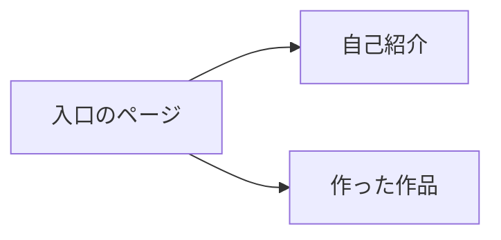

# 山田 太郎のポートフォリオ

Web 制作を勉強している山田 太郎の作品をまとめたサイトです。

## ページの一覧

| ファイル   | 中身         |
| ---------- | ------------ |
| index.html | 入口のページ |
| about.html | 自己紹介     |
| works.html | 作った作品   |

## ページのつながり

## これからやること

- 作品のページに写真を足す
- [VS Code の公式サイト](https://code.visualstudio.com/) を読む
